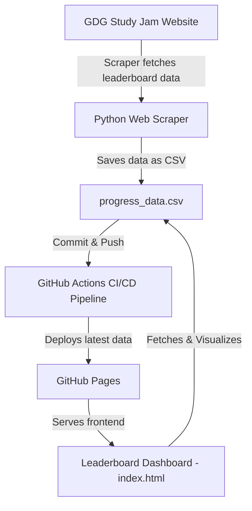

# GDG Study Jam Leaderboard

A dynamic **Leaderboard Dashboard** built for **Google Developer Group (GDG) Study Jam 2025**, designed to visualize participant progress, badges, and game completions in real-time.  
This project automatically updates leaderboard data every 30 minutes using a **web scraping + CI/CD automation pipeline** and displays it beautifully through a **fully responsive, animated frontend.**

---

## Project Overview

During the GDG Study Jam, it was difficult to track participant progress as the Google platform updated only once every 24 hours.  
To solve this, our team developed an **automated leaderboard system** that:
- Scrapes the updated participant data from the Study Jam dashboard every 30 minutes.
- Pushes the refreshed CSV data (`progress_data.csv`) automatically to GitHub Pages.
- Updates the leaderboard webpage using CI/CD (GitHub Actions) — **no manual intervention required**.

This allows the GDG community to view real-time rankings, achievements, and progress in a visually engaging way.

---

## 💻 Tech Stack

| Component | Technology Used |
|------------|----------------|
| **Frontend** | HTML5, CSS3 (Google-style design), Vanilla JavaScript |
| **Data Handling** | CSV Parsing via JS, Dynamic DOM Rendering |
| **Automation** | Web Scraping Script (Python) + GitHub Actions CI/CD |
| **Hosting** | GitHub Pages |
| **Design Aesthetic** | Google Material Theme + Animated Particles + Gradient Cards |

---

## 🧠 Key Features

- **Modern Google-themed UI** with animations, gradients, and responsive layout  
- **Auto-updated leaderboard** every 30 minutes (via CI/CD pipeline)
- **Stats dashboard** for total badges, games, and participants
- **Search & Filter** participants dynamically (All / Badges / Games / Active)
- **Rank Highlights** for Top 3 with Gold, Silver, Bronze badges
- **Achievement Levels** (Beginner → Expert)
- **Progress bars** with smooth transitions and shimmer effects
-  **CSV-based data loading** (no backend required)
-  **Secure parsing & sanitization** to prevent injection attacks

---

##  Project Structure

    📁 GDG-StudyJam-Leaderboard/
    │
    ├── 📄 index.html # Main dashboard file (HTML, CSS, JS integrated)
    ├── 📄 progress_data.csv # Auto-updated participant data file
    ├── 📄 README.md # Project documentation
    ├── 📄 .github/workflows/ci.yml # GitHub Actions pipeline (auto data update)
    └── 📜 scraper.py # Data scraping script (fetches leaderboard data)


---

##  How It Works

### 1. **Data Collection**
A Python-based scraper fetches participant progress from the official GDG Study Jam page.  
It cleans and saves it into `progress_data.csv`.

### 2. **Automation Pipeline**
GitHub Actions automatically:
- Runs the scraper every 30 minutes.
- Commits the updated CSV to the repository.
- Deploys it to GitHub Pages.

### 3. **Dynamic Frontend**
When the page loads:
- The JS script fetches the latest `progress_data.csv`
- Parses it into structured objects
- Sorts, ranks, and visually renders leaderboard cards.

---

##  Run Locally

    ```bash
    # Clone the repository
    git clone https://github.com/your-username/GDG-StudyJam-Leaderboard.git

    #  Navigate to project directory
    cd GDG-StudyJam-Leaderboard

    # Open the leaderboard
    open index.html   # or just double-click index.html


## ⚙️ System Architecture




## Team
  ``` bash
 Name	          Role
 Mohit Sharma	  Frontend Developer 
 Pushkar Sharma	CI/CD Setup, Web Scraper & Data Automation Developer


